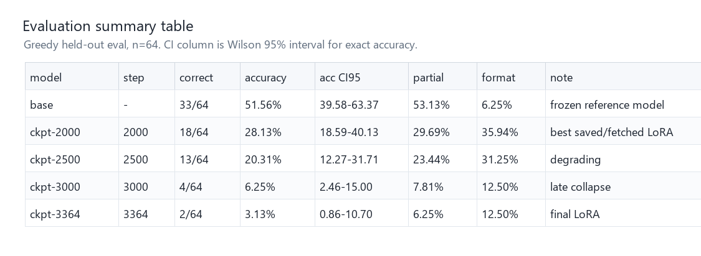
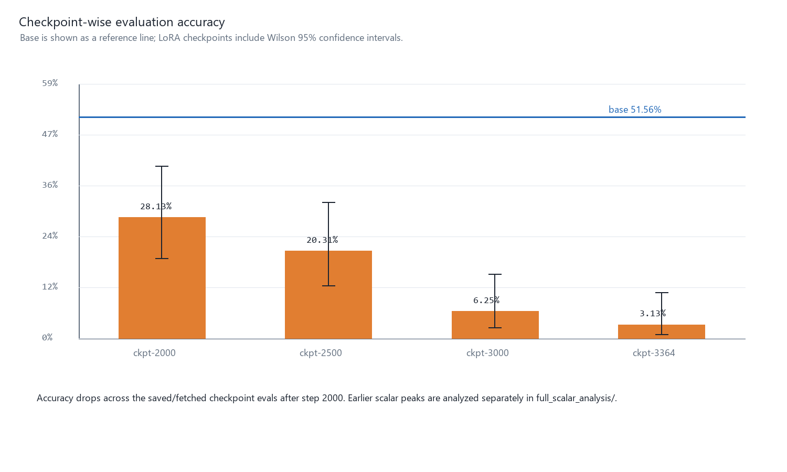
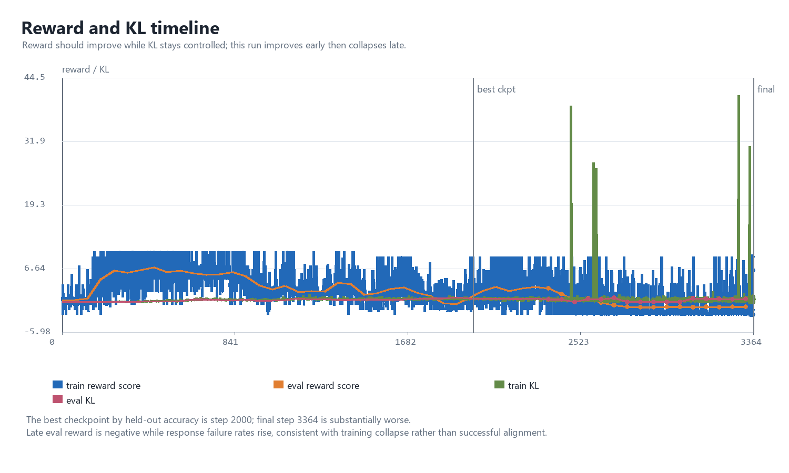
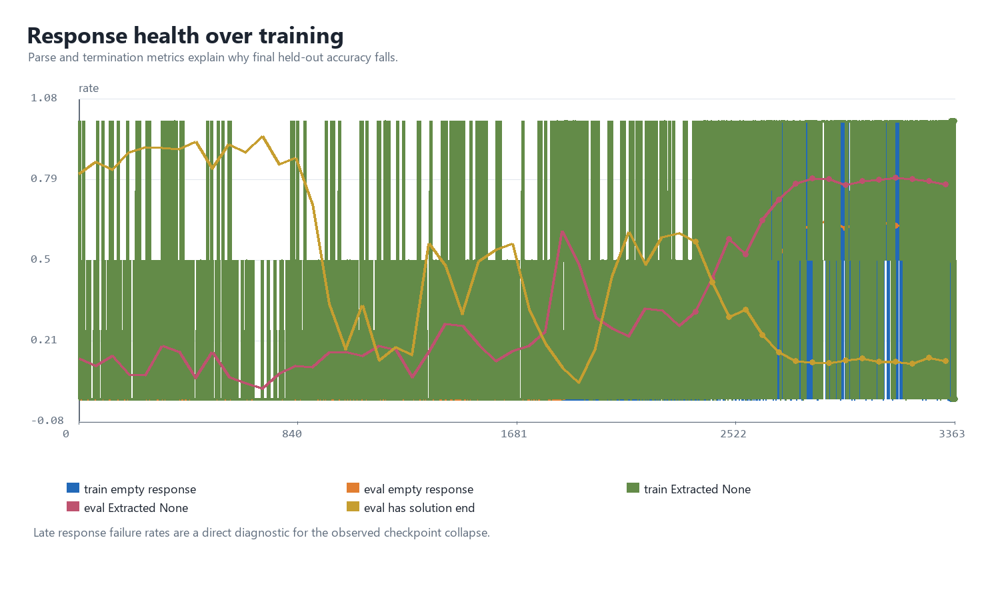
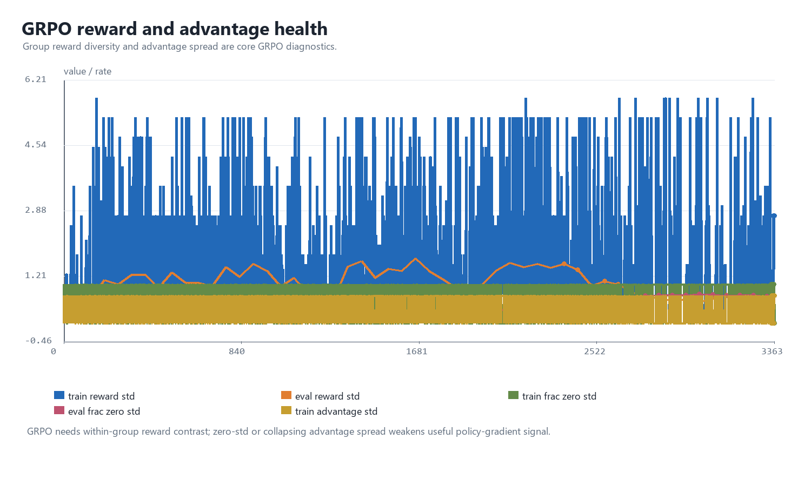
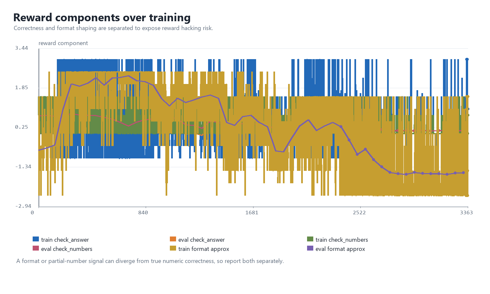
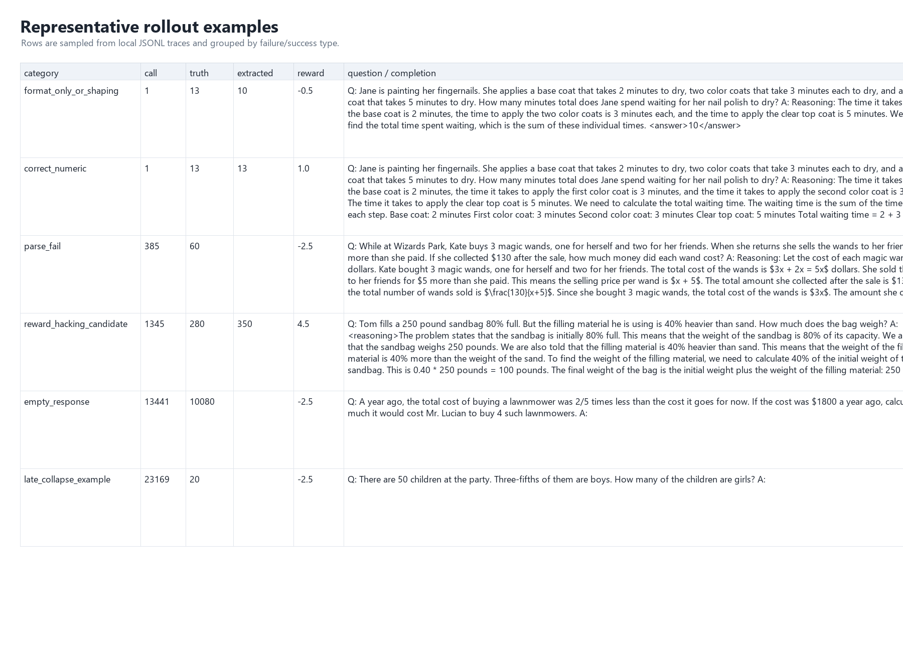
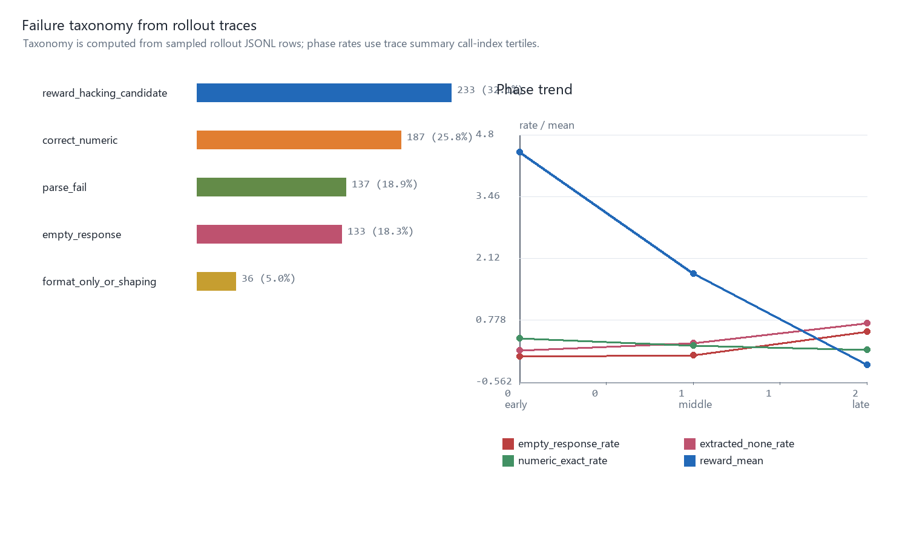
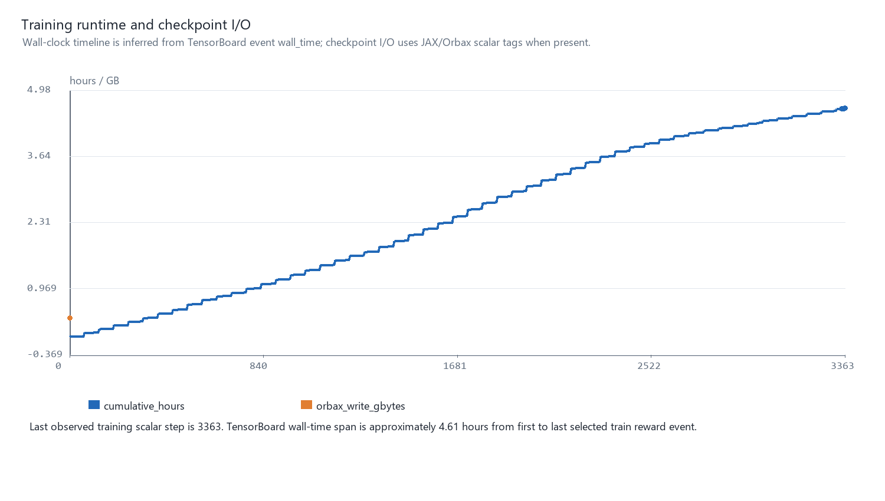
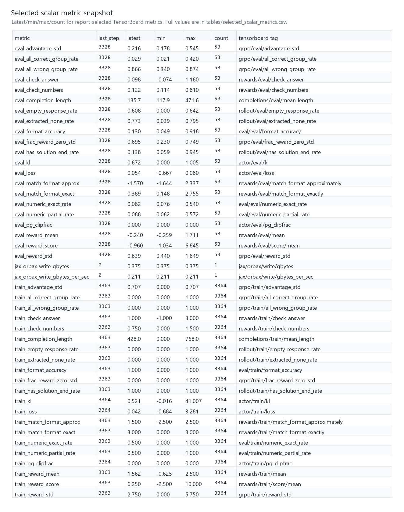

# GRPO Baseline `course-baseline-001` Full Evidence Report

## Technical Summary

This report package summarizes the completed baseline full run on the course TPU `waxvhe`. The reproduction pipeline finished and produced base evaluation, full training artifacts, final LoRA evaluation, checkpoint-wise evaluation, TensorBoard scalars, rollout traces, and diagnostic plots. The training results also show that the baseline collapses late in training.

The key result has two layers. Checkpoint-wise evaluation only covers saved and fetched checkpoints: the base model reaches **51.56%** on held-out greedy evaluation, the final LoRA step `3364` reaches only **3.13%**, and the best saved/fetched LoRA checkpoint is step `2000` at **28.13%**. However, the full TensorBoard scalar timeline shows earlier signal peaks: `eval_reward_score` peaks at step 448, `eval_numeric_exact_rate` peaks at step 256, and `eval_format_accuracy` peaks at step 704. Therefore, I.1 can report that the run completed with complete evidence, but step 2000 should not be described as the training optimum, and the final checkpoint should not be described as an effective improvement.

## Key Findings With Visual Evidence

**Takeaway**: Base model is strongest; final LoRA collapses to 3.13%, while best LoRA is step 2000 at 28.13%.

**Takeaway**: LoRA accuracy degrades after step 2000; final checkpoint is not the best model.

**Takeaway**: Small multiples show the late degradation without mixing incompatible scales.

**Takeaway**: Empty/parse-failure indicators rise late, matching the final accuracy collapse.

**Takeaway**: Reward diversity, zero-std rate, advantage spread, and group correctness are recorded separately.

**Takeaway**: Correctness and format-shaping reward components are separated for auditability.

**Takeaway**: Qualitative traces reveal concrete failure modes behind the aggregate metrics.

**Takeaway**: Wrong numeric answers dominate, with late response/parse failures explaining collapse.

**Takeaway**: TensorBoard wall-time gives a reproducible runtime estimate and checkpoint I/O context.

**Takeaway**: The metric snapshot records latest value and observed range for every report-selected scalar.

## Scope, Data, And Metric Definitions

This report uses the locally fetched directory `artifacts/cloud/course-baseline-001/`. It does not reconnect to the TPU or rerun training. Evaluation uses the default greedy preset with 64 test batches; checkpoint-evaluation confidence intervals come from the existing summary's Wilson 95% CI.

The complete scalar analysis is in `full_scalar_analysis/`. `tables/full_scalar_long.csv` stores every report-selected TensorBoard scalar row without downsampling, `tables/full_scalar_pivot.csv` expands those rows by step, and `tables/scalar_peak_summary.csv` records max/min/latest values plus the peak step for each metric. Figures are rendered views, not the only source of data.

Core metric definitions:

- `accuracy`: numeric exact match, the primary task-success metric.
- `partial_accuracy`: numeric partial match, useful for checking whether extracted numbers are partially close.
- `format_accuracy`: whether the output satisfies the expected format; this is a shaping/format metric, not mathematical correctness.
- `rewards/*`: reward components and total reward, used to interpret the training signal.
- `actor/*/kl`: KL-constraint signal between the current policy and reference policy.
- `grpo/*/reward_std` and `frac_reward_zero_std`: within-group reward diversity; sustained zero or very high zero-std weakens the GRPO learning signal.
- `rollout/*/empty_response_rate` and `extracted_none_rate`: response and parsing health, which help explain divergence between reward and evaluation accuracy.

## Baseline Configuration

| Key | Value |
|---|---:|
| `MODEL_ID` | `google/gemma-3-1b-it` |
| `DATA_SOURCE` | `tfds` |
| `MAX_STEPS` | `3364` |
| `NUM_BATCHES` | `3738` |
| `NUM_EPOCHS` | `1` |
| `NUM_GENERATIONS` | `2` |
| `NUM_TEST_BATCHES` | `64` |
| `EVAL_EVERY_N_STEPS` | `64` |
| `SAVE_INTERVAL_STEPS` | `500` |
| `BETA` | `0.08` |
| `EPSILON` | `0.2` |
| `LEARNING_RATE` | `3e-06` |
| `RANK` | `64` |
| `ALPHA` | `64.0` |
| `MAX_PROMPT_LENGTH` | `256` |
| `TOTAL_GENERATION_STEPS` | `768` |
| `TRAIN_MICRO_BATCH_SIZE` | `1` |
| `TRAIN_FRACTION` | `0.9` |

## Evaluation Results

| Label | Policy | Step | Accuracy | Partial | Format | Correct |
|---|---|---:|---:|---:|---:|---:|
| base_direct_eval | base | None | 51.56% | 53.13% | 6.25% | 33/64 |
| final_lora_direct_eval | lora | 3364 | 3.13% | 6.25% | 12.50% | 2/64 |
| base | base | None | 51.56% | 53.13% | 6.25% | 33/64 |
| ckpt-2000 | lora | 2000 | 28.13% | 29.69% | 35.94% | 18/64 |
| ckpt-2500 | lora | 2500 | 20.31% | 23.44% | 31.25% | 13/64 |
| ckpt-3000 | lora | 3000 | 6.25% | 7.81% | 12.50% | 4/64 |
| ckpt-3364 | lora | 3364 | 3.13% | 6.25% | 12.50% | 2/64 |

## Collapse Diagnosis

The main issue in this run is not missing artifacts. It is that the final checkpoint does not represent the best model, and checkpoint evaluation cannot cover the early scalar peaks. Among saved and fetched checkpoints, checkpoint-wise evaluation shows step 2000 outperforming 2500/3000/final. The complete scalar timeline, however, shows eval score, numeric exact, and format accuracy peaking between steps 256 and 704. Because those early steps do not have locally recoverable checkpoints, the report cannot provide held-out checkpoint evaluation for those exact models and can only report the scalar peaks. Late response-health metrics show parse failures and empty responses worsening, and eval reward turns negative. When GRPO reward-shaping terms diverge from true task-success metrics, the model may learn local formatting or short-output behavior rather than stable mathematical solving.

## GRPO-Specific Interpretation

The baseline keeps the course defaults: `NUM_GENERATIONS=2`, `BETA=0.08`, `EPSILON=0.2`, `LEARNING_RATE=3e-6`, and `MAX_STEPS=3364`. From the perspective of mature GRPO/RLHF infrastructure, later reproduction experiments should jointly track reward, KL, clip ratio, completion length, reward_std/zero_std, advantage spread, held-out evaluation, and sample tables. The reward curve alone is not enough to judge training success.

## Evidence Gallery

Representative examples are collected in `samples/sample_examples.csv/json` and visualized in `figures/07_trace_examples_table.png`. Samples are categorized as correct, wrong numeric, parse fail, empty response, reward-hacking candidate, and late collapse so the report can cite concrete outputs.

## Limitations

- Evaluation uses only 64 test batches. That is suitable for course baseline reproduction but is not a full benchmark.
- W&B was not enabled; this report uses TensorBoard, JSON evaluation, rollout traces, and the pipeline log as evidence sources.
- I.3 improvement experiments were not run, so next experiments are design suggestions rather than experimental results.
- Rollout traces are observability samples, not a full generation audit.

## Recommended Next Experiments

1. Add early checkpoint saving and evaluation to later runs, especially covering steps 128/256/448/704/1000; this run's early scalar peaks have no corresponding recoverable checkpoints.
2. Add early stopping or model selection: stop when held-out numeric accuracy drops clearly from its peak.
3. Lower the learning rate or adjust `BETA`, then inspect whether KL and clipfrac become smoother.
4. Report format shaping separately from numeric correctness so format reward does not hide task failure.
5. Add response-health gates that alert on empty response, Extracted None, and completion truncation thresholds.
6. Keep the sample table because qualitative outputs are important for diagnosing GRPO collapse.

## External Metric/Infra References

- [Tunix metrics](https://tunix.readthedocs.io/en/stable/metrics.html): Tunix collected metrics, TensorBoard/W&B backends, and performance tracing.
- [HF TRL GRPO logging](https://huggingface.co/docs/trl/v0.21.0/en/logging): GRPO reward, KL, clip ratio, completion length, and entropy logging guidance.
- [OpenRLHF logging/eval](https://openrlhf.readthedocs.io/en/latest/agent_training.html): RLHF logging backends, periodic evaluation, reward/advantage/generation metrics.
- [VeRL-Omni metrics](https://verl-omni.readthedocs.io/en/latest/start/metrics.html): GRPO reward diversity, zero-std ratio, clipping, and ratio stability framing.
- [W&B Tables](https://docs.wandb.ai/models/track/log/log-tables): Prediction/sample table organization used as a reporting pattern.
- [W&B Artifacts](https://docs.wandb.ai/models/artifacts): Versioned run inputs/outputs pattern for report package provenance.
- [tbparse](https://tbparse.readthedocs.io/en/stable/): TensorBoard event-to-dataframe pattern mirrored with existing scalar exports.
