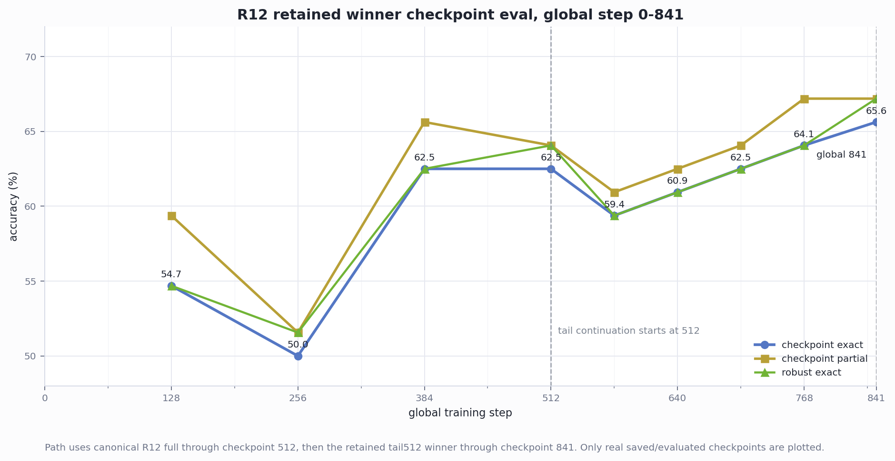
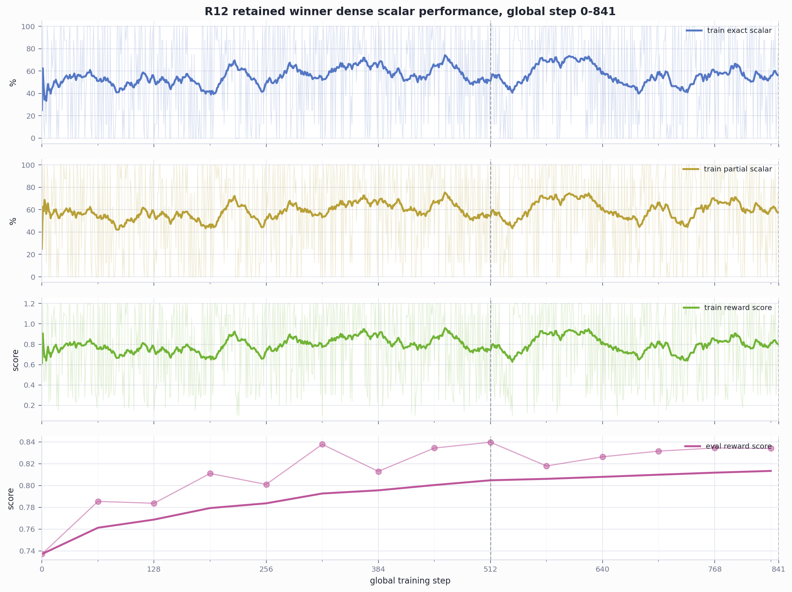
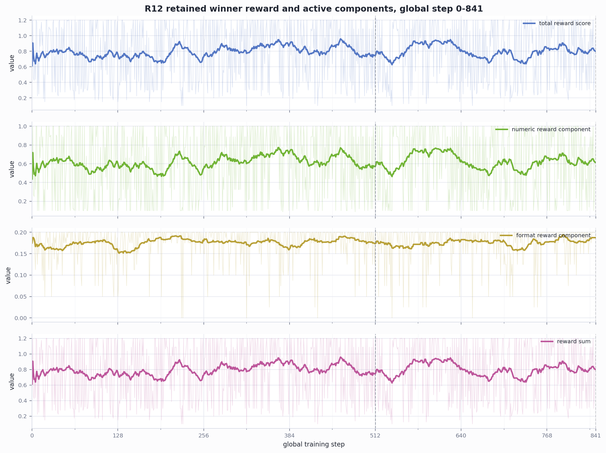
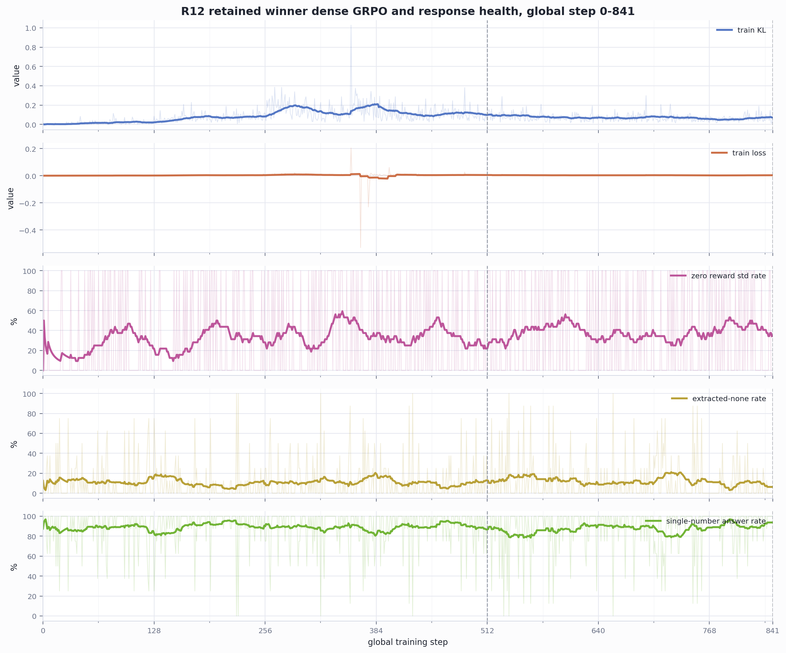

# R12 Tail512 Winner Visual Summary

Winner retained in this package:

- Run: `r12-full-autotune-tail512-001`
- Branch: `R12_tail_lr1e-6_beta004_from512`
- Source: canonical `reward-k8-beta004-r12-full-001` checkpoint `512`
- Config: `REWARD_MODE=gsm8k_verifiable_simple`, `K=8`, `BETA=0.04`, `LEARNING_RATE=1e-6`, `RANK=64`, `ALPHA=64`
- Best checkpoint: step `841`, exact `65.625`, partial `67.1875`
- Canonical R12 full best: exact `62.5`, partial `65.625`

## Global Full-Step View

These figures keep the original global training coordinate from `0` to `841`.
They do not reset the x-axis at checkpoint `512`. The retained winner path uses
canonical R12 full through source checkpoint `512`, then the best tail
continuation through final checkpoint `841`. Checkpoint eval is only plotted
where a saved/restorable checkpoint actually exists; the denser views use
TensorBoard scalar traces, not fabricated checkpoint evals.

Supporting tables:

- `tables/winner_global_checkpoint_eval.csv` stores the exact checkpoint eval
  points used in the global checkpoint chart.
- `tables/winner_global_scalar_grid_32.csv` samples the nearest recorded scalar
  values every `32` global steps, plus final global step `841`.

## Combined Comparison

These figures compare the retained winner branch against the non-winning
`beta=0.06, lr=1e-6` branch from the same tail512 run.

## Winner Raw Timelines

These winner-only figures preserve the raw curve view, not just the combined
rolling-mean comparison.

## Reading Notes

- Checkpoint eval is the decisive performance read. In global coordinates, the
  retained winner path goes `54.6875 -> 50.0 -> 62.5 -> 62.5 -> 59.375 ->
  60.9375 -> 62.5 -> 64.0625 -> 65.625` across checkpoints `128, 256, 384,
  512, 576, 640, 704, 768, 841`. The final checkpoint is the best
  saved/evaluated point and beats the canonical R12 full best.
- Reward composition latest for the winner is mostly numeric reward
  (`0.775` mean numeric component, `0.2` mean format component).
- The retained raw run remains at
  `artifacts/cloud/r12-full-autotune-tail512-001`; this visual package only
  copies report-ready figures and small provenance tables.
